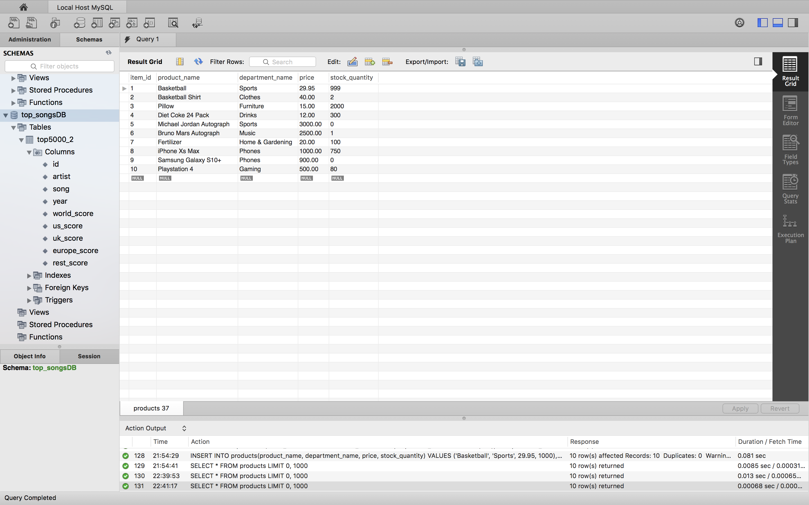
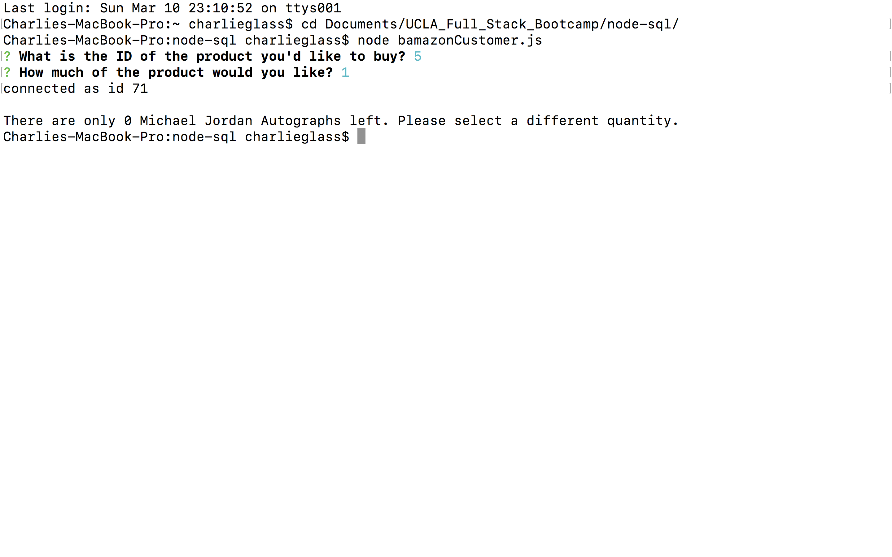
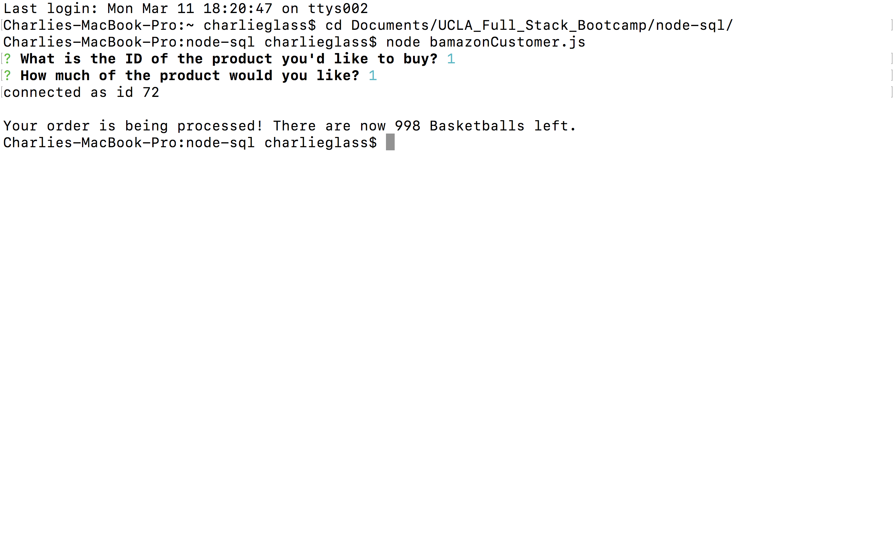
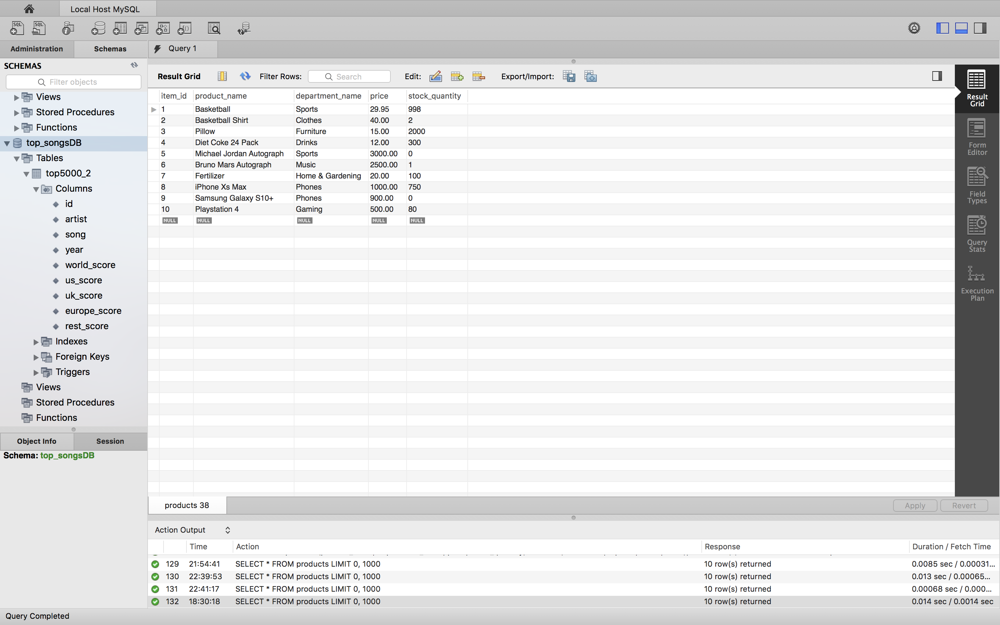

# node-sql
This MySQL app is a Node Command Line Application.  It allows the user to request an order of a product by asking for its ID and the quantity the user would like to purchase.

The user is prompted for the product ID and quantity using the npm package `inquirer`.  Then, using the npm package `mysql`, the program selects from a table `products` from a local database `bamazon`.  

The original table appears as such:

When the user requests to purchase the product with `id` = 5, which has 0 quantity, the command line app returns an insufficient quantity message and does nothing to the table:

However, if the user orders 1 of the product with `id` = 1, the order is processed, and the table is properly updated:

And if we query the table directly, the decrease in quantity is shown:
